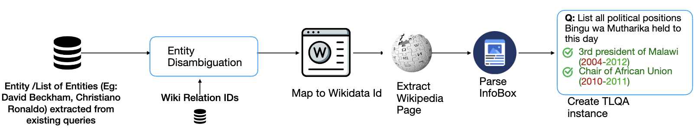

# TimeLine based List Question Answering (TLQA)

<p align="center">
  
</p>

# Data Collection pipeline
<p align="center">
  
</p>
 
To reproduce data collection, run the files im `data_pipeline`. Run the files in this order: `tempLama.py`, `addWikiDataIDs.py`, `fetch_most_common_name.py`, `offices_parser.mjs`, `sport_parser.mjs`.

# Reproducing Results on paper
Inference on the benchmark for multiple settings can be seen in folder `inference`. Experiments were done using `ollama` for open-weight models, and `litellm` for proprietary models. 

The script evaluateResults.py in evaluation/ can be used to reproduce the numbers on the table and the plots.

# Corpus
The title to infobox mapping can be downloaded here https://drive.google.com/drive/folders/1KyYiQEYob5SkK3zyUCXoPRT19dANy2-a?usp=sharing 

##  :file_folder: File Structure


```
.
├── LICENSE.MD
├── README.md
├── TLQA.png
├── TLQA_data_splits
│   ├── benchmark_v0.0.json
│   └── splits
│       ├── add_wikipedia_titles.py
│       ├── get_golden_evidence.py
│       ├── test_split_benchmark_v0.0.json
│       ├── test_split_benchmark_v0.0_golden_evidence.json
│       ├── test_split_benchmark_v0.0_updated_with_titles.json
│       ├── train_split_benchmark_v0.0.json
│       ├── train_split_benchmark_v0.0_golden_evidence.json
│       └── train_split_benchmark_v0.0_updated_with_titles.json
├── TempLama
│   ├── data
│   │   ├── templama_test.json
│   │   ├── templama_train.json
│   │   └── templama_val.json
│   ├── evaluateData.py
│   ├── evaluateResults.py
│   ├── experiment.py
│   ├── gpt3_responses.csv
│   ├── listqas.json
│   ├── output.json
│   ├── queryGPT.py
│   ├── tempLama.py
│   ├── templama_test.json
│   ├── templama_train.json
│   └── templama_val.json
├── data_pipeline
│   ├── offices_parser.mjs
│   ├── sport_parser.mjs
│   ├── tempLama.py
│   └── test.py
├── inference
│   ├── few_shot.py
│   ├── rag_title_summary.
│   └── rag_golden_evidence.py
├── evaluation
│   └── evaluateResults.py
├── output.txt
├── test.py
├── tlqa_1.png
└── tlqa_2.png
```
